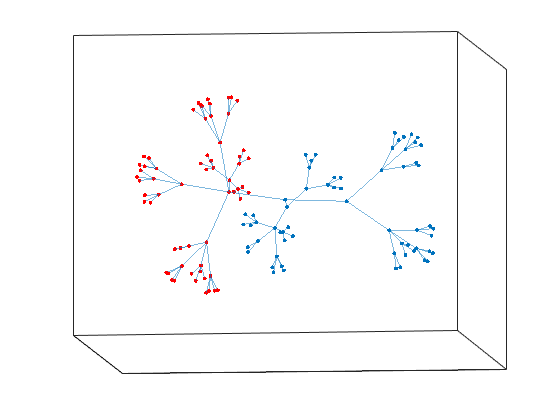

# Fielder-s-Algorithm-Bipartitioning-a-Tree-
To run this algorithm you need put all arquives in the same directory, and run fiedler_2.m
If you want generate different types of a trees you can change the parameters at Tree_Generator_main.m

